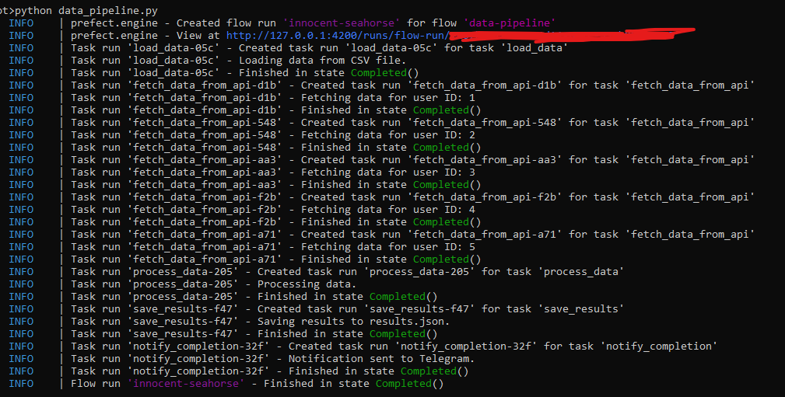

# PipeBot



This project implements a data processing pipeline using Prefect 3.0. The pipeline performs the following tasks:

1. Loads data from a CSV file.
2. Fetches data from a third-party API for each row.
3. Processes the data using pandas.
4. Saves the results as JSON files.
5. Sends a notification via Telegram on completion.

## Prerequisites

- Python 3.8+
- Docker
- Prefect 3.0

## Setup

1. Clone this repository:

    ```bash
    git clone https://github.com/superbabii/PipeBot.git
    cd PipeBot
    ```

2. Create a virtual environment and activate it:

    ```bash
    python -m venv venv
    source venv/bin/activate  # On Windows use `venv\Scripts\activate`
    ```

3. Install dependencies:
    ```bash
    pip install -r requirements.txt
    ```

## Usage

1. Start the Prefect server:

    ```bash
    prefect server start
    ```

2. Start the Prefect worker:

    ```bash
    prefect worker start --pool default-agent-pool
    ```

3. Run the pipeline:

    ```bash
    python data_pipeline.py
    ```

## Configuration

- Ensure your input CSV file (`data.csv`) is in the same directory and has a column named `userId`.
- The results will be saved to `results.json` in the same directory.

## Docker Setup

To containerize the application, follow these steps:

1. Build the Docker image:

    ```bash
    docker build -t prefect-pipeline .
    ```

2. Run the Docker container:

    ```bash
    docker run -e TELEGRAM_BOT_TOKEN=<your-telegram-bot-token> -e TELEGRAM_CHAT_ID=<your-chat-id> -v $(pwd):/app prefect-pipeline python data_pipeline.py
    ```

## Additional Notes

- Modify the `data_pipeline.py` script as needed to adjust API calls and data processing logic.
- Ensure that Docker is installed and running on your machine.

## License

This project is licensed under the MIT License.

## Monitoring

Use the Prefect Orion UI to monitor the pipeline at [http://localhost:4200](http://localhost:4200).

